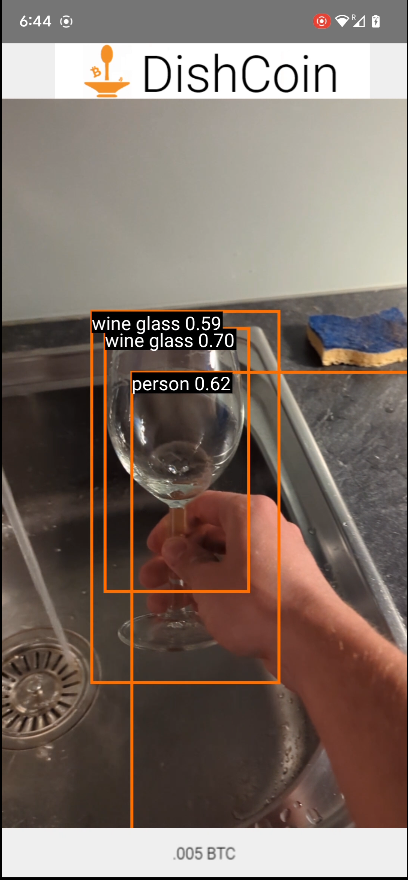

# DishCoin - dishwashing sagas
## Note
This repository is only for the demo mobile app. All blockchain/BitCoin related for our project can be found at this repositiry: https://github.com/albertoZurini/quantitative_chamber_starthack23

### Overview

DishCoin is an app, powered by Computer Vision, that is made to assess your dishwashing efficiency.
Load your DishCoin wallet with BitCoin and compete with your friends for the goal of saving
water through dishwashing efficiency sagas. The winner takes it all!

### The Tech
The neural network used for the detection of people, cuttlery and dishes is the:

[MobileNet SSD](https://tfhub.dev/tensorflow/lite-model/ssd_mobilenet_v1/1/metadata/2),
model trained on the [COCO dataset](http://cocodataset.org/). 
The app should be run on a physical Android device.